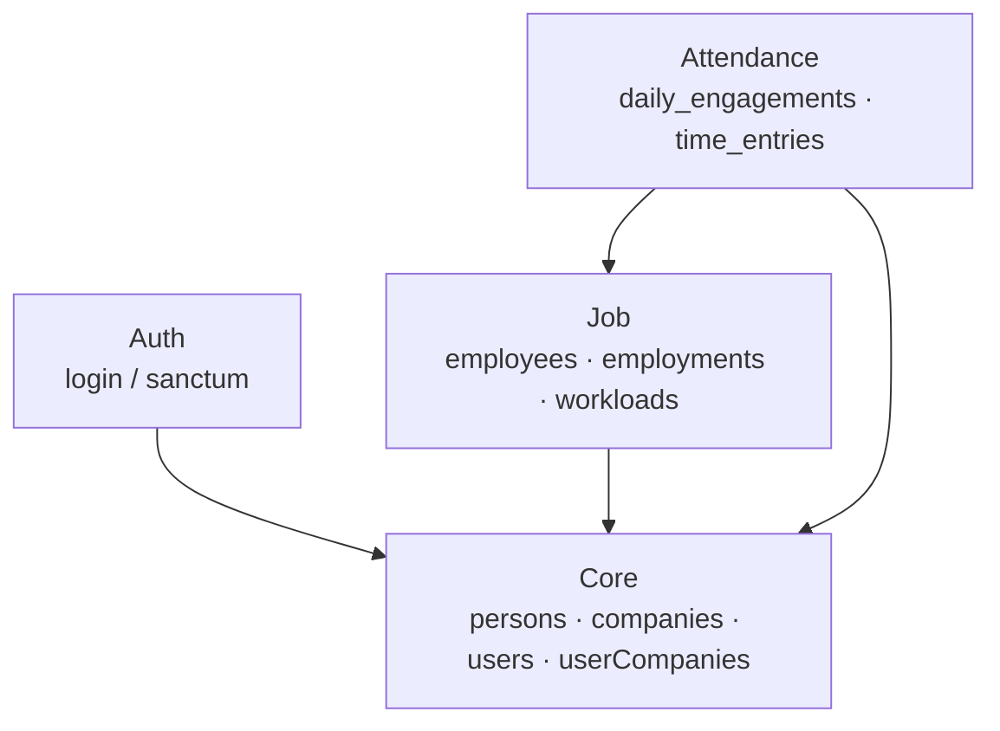
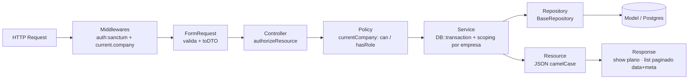
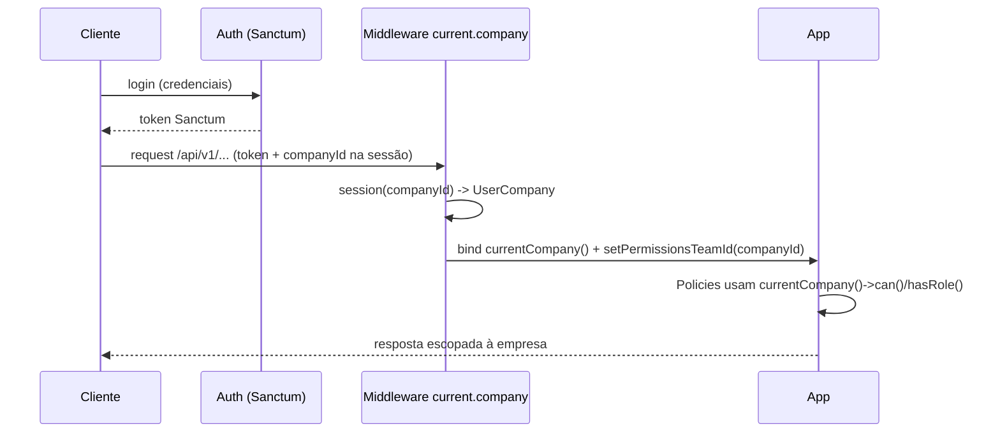
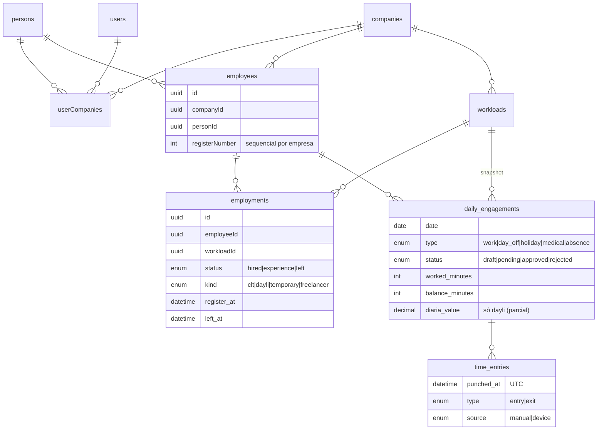
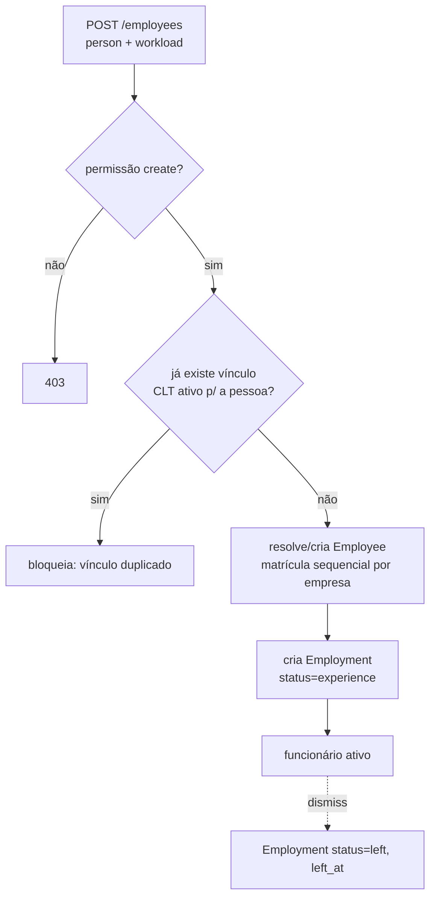
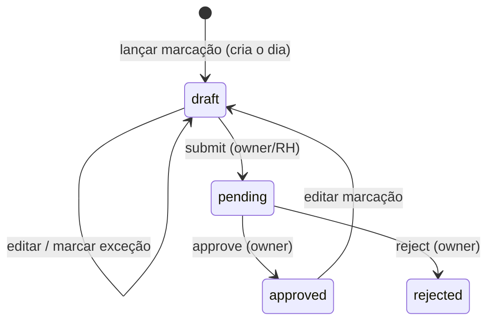

# VHR — Fluxo Geral do Sistema

Visão de ponta a ponta: arquitetura modular, ciclo de uma requisição, multi-empresa/autorização, modelo de dados e os fluxos de cada módulo.

---

## 1. Módulos

- **Core** — base: pessoas, empresas, usuários e o vínculo usuário↔empresa (`userCompanies`) que carrega papéis/permissões.
- **Auth** — autenticação (Sanctum).
- **Job** — funcionários, vínculos (employment) e jornadas (workload).
- **Attendance** — lançamento de ponto (depende de Job e Core).

Cada módulo tem schema Postgres próprio (`core.*`, `job.*`, `attendance.*`).

---

## 2. Arquitetura em camadas (ciclo de uma requisição)

Convenções fixas em todos os módulos:
- **Request** valida e converte para um **DTO** (spatie/laravel-data).
- **Controller** fino: `authorizeResource` + delega ao **Service** + `response()->json()`.
- **Policy** decide acesso via `currentCompany()?->can(...)` (permissão) ou `?->hasRole(...)` (papel).
- **Service** concentra regra de negócio, roda em `DB::transaction`, escopa por empresa e retorna `->toResource()`.
- **Repository** (`BaseRepository`) padroniza acesso a dados; ligado por contrato no `AppServiceProvider`.
- **Listagem** sempre paginada: `->paginate()->through(fn => ->toResource())` → `{ data, current_page, per_page, total }`.

---

## 3. Multi-empresa & autorização

- Um usuário pode ter vários vínculos (`userCompanies`) — um por empresa.
- O middleware `current.company` resolve a **empresa ativa** (`currentCompany()`) e fixa o *team* de permissões (Spatie) naquela empresa.
- Toda leitura/escrita é **escopada por empresa**; `companyId` vem do contexto, nunca do payload do cliente.

### Papéis e permissões

| Permissão / Papel                         | owner | humanResource | accountant | employee |
|-------------------------------------------|:-----:|:-------------:|:----------:|:--------:|
| core.persons.*                            | ✓     | view/create/update | view  | view     |
| core.companies / users                    | ✓     | view (company)| view (company) | — |
| job.workloads.*                           | ✓     | ✓             | view       | —        |
| job.employees.* (+ dismiss)               | ✓     | ✓             | view       | view     |
| attendance.timeEntries.*                  | ✓     | view/create/update/delete | view | view |
| attendance.dailyEngagements.view          | ✓     | ✓             | ✓ (só aprovados) | ✓ (próprios) |
| attendance.dailyEngagements.create/update | ✓     | ✓             | —          | —        |
| attendance.dailyEngagements.approve       | ✓     | —             | —          | —        |

---

## 4. Modelo de dados

---

## 5. Fluxo: Job (contratação)

- **Employee** = identidade do funcionário na empresa (matrícula única por empresa).
- **Employment** = vínculo contratual (histórico; recontratação cria novo).
- **Workload** = jornada (horários + carga horária), base do cálculo de ponto.
- A jornada **ativa** de um funcionário: `employee.activeEmployment.workload`.

---

## 6. Fluxo: Attendance (ponto)

Resumo abaixo; detalhes em [`Modules/Attendance/FLOW.md`](Modules/Attendance/FLOW.md).

- **TimeEntry** = marcação (1 linha por ação, entrada/saída); `punched_at` em **UTC**.
- **DailyEngagement** = o dia (1 por funcionário/data); lançar marcação cria o dia em `draft`.
- **Cálculo** (`AttendanceCalculator`): soma só pares entrada→saída; marcação em aberto não conta. `expected`/`balance` variam por tipo (folga/feriado/atestado/falta).
- **Visibilidade**: rascunho só p/ quem criou; **contador só vê aprovados**; funcionário só os próprios.
- **Diária** (`dayli`): estrutura pronta, regra de pagamento **provisória** isolada em `DiariaRule`.

---

## 7. Onde está cada coisa

| Camada            | Caminho                                             |
|-------------------|-----------------------------------------------------|
| Contratos/repos   | `app/Contracts/*` + binding em `app/Providers/AppServiceProvider.php` |
| Base de repositório | `app/Supports/Abstracts/BaseRepository.php`       |
| Helpers / empresa | `app/Helpers/functions.php` (`currentCompany()`, `*Repo()`) |
| Empresa ativa     | `app/Http/Middlewares/SetActiveCompany.php`         |
| Papéis/permissões | `Modules/Core/database/seeders/RolesAndPermissionsSeeder.php` |
| Cada domínio      | `Modules/<Modulo>/app/{Models,Services,Policies,Http,...}` |
| Modelo visual     | `DER.dbml`                                           |
