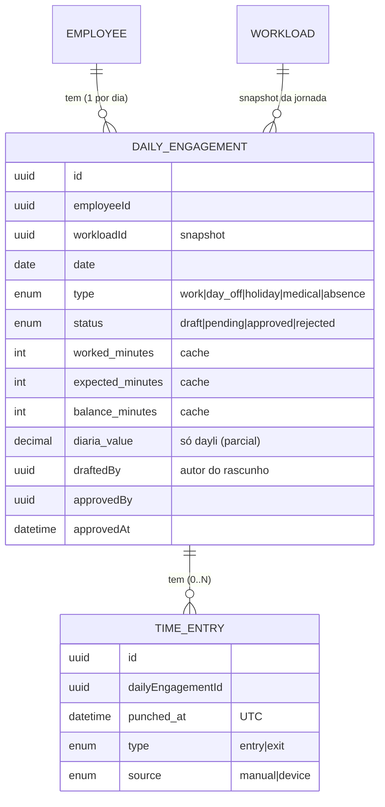
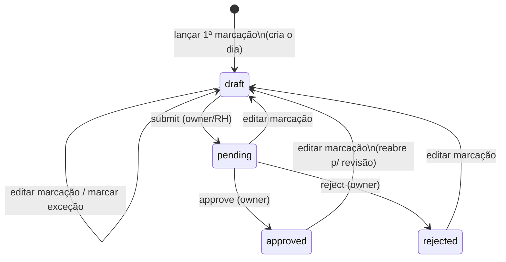
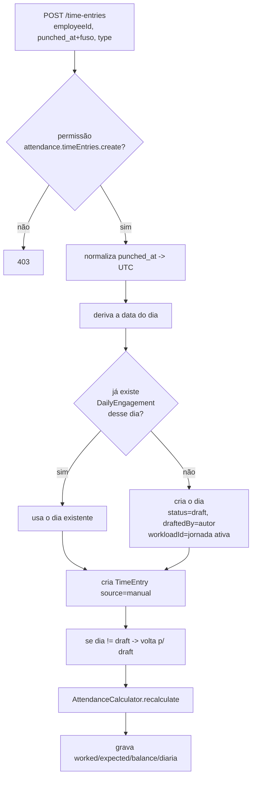
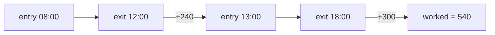
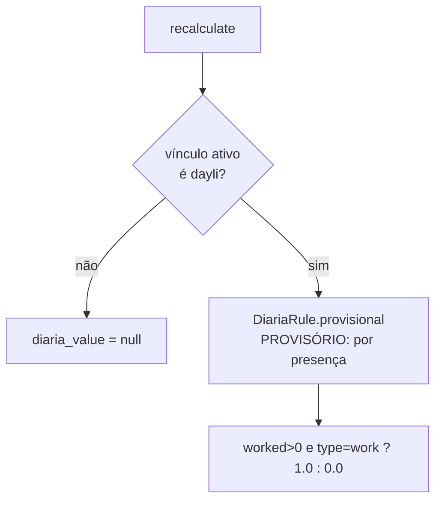

# Módulo Attendance — Fluxo

Digitalização da planilha de ponto: lançamento manual (retroativo), cálculo de horas/saldo, exceções e aprovação. Sem bate-ponto automático.

## Entidades

- **DailyEngagement** = o dia consolidado por funcionário (1 por funcionário/data).
- **TimeEntry** = cada marcação (1 linha por ação: entrada/saída).

## Máquina de estados do dia

- O dia **nasce `draft`** ao lançar a primeira marcação.
- Qualquer **edição** de marcação (criar/alterar/excluir) ou **marcar exceção** devolve o dia para `draft` e limpa a aprovação.
- **`submit`** (owner/RH) envia `draft → pending`.
- **`approve`/`reject`** (só owner) agem apenas sobre `pending`.

## Fluxo de lançamento de marcação

## Cálculo (AttendanceCalculator)

**worked_minutes** — soma só pares **entrada → saída** completos, em ordem de horário:

- Mantém a **primeira entrada aberta**; entradas repetidas são ignoradas.
- Saída sem entrada aberta é ignorada.
- **Marcação em aberto (entrada sem saída) NÃO é calculada.**
- Funciona cruzando meia-noite (diferença entre dois `datetime`).

**expected_minutes / balance_minutes** dependem do `type` do dia:

| type      | expected             | worked                 | balance         |
|-----------|----------------------|------------------------|-----------------|
| `work`    | jornada (ex.: 540)   | das marcações          | worked − expected |
| `day_off` | 0                    | das marcações (0)      | 0               |
| `holiday` | 0                    | das marcações (0)      | 0               |
| `medical` | jornada              | **abonado = expected** | 0               |
| `absence` | jornada              | 0                      | − expected      |

> `expected` = `(left_time − entry_time) − (interval_end − interval_start)` da jornada (workload) snapshot. Sem workload no dia → `expected = 0`.

## Diária (`dayli`) — parcial

A regra de pagamento real (presença × horas × meia-diária) ainda depende do cliente — vive só em `DiariaRule`. O dado cru (worked + presença) já é persistido, então trocar a regra não exige migration.

## Visibilidade (quem vê o quê)

| Papel            | O que enxerga na listagem/relatório                     |
|------------------|---------------------------------------------------------|
| owner / RH       | Todos os dias da empresa; rascunho **só o que ele criou** |
| **contador**     | **Somente dias `approved`** (relatório de horas)        |
| funcionário comum| Somente os **próprios** dias (via `personId`)           |
| qualquer um      | Rascunho (`draft`) só é visível para **quem o criou** (`draftedBy`) |

## Timezone

- `punched_at` é **convertido para UTC** no back (`08:00-03:00` → grava `11:00`).
- Lançamento é **retroativo**: a hora vem sempre do dado enviado, nunca do servidor.
- O front converte de volta para o fuso local na exibição.
- Cálculo de horas é diferença entre marcações → indiferente ao fuso.

## Permissões

`attendance.timeEntries.{view,create,update,delete}` · `attendance.dailyEngagements.{view,create,update,approve}`
- `approve` → só owner. `update/delete` de marcação → owner/RH (role).
